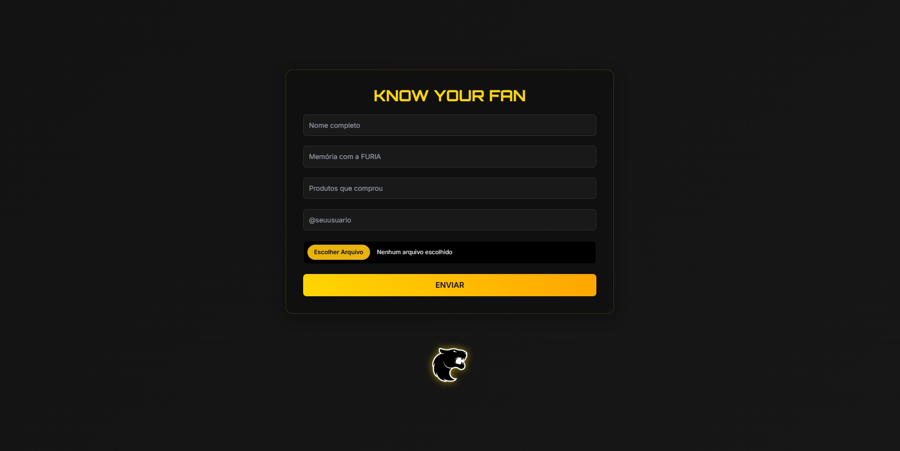
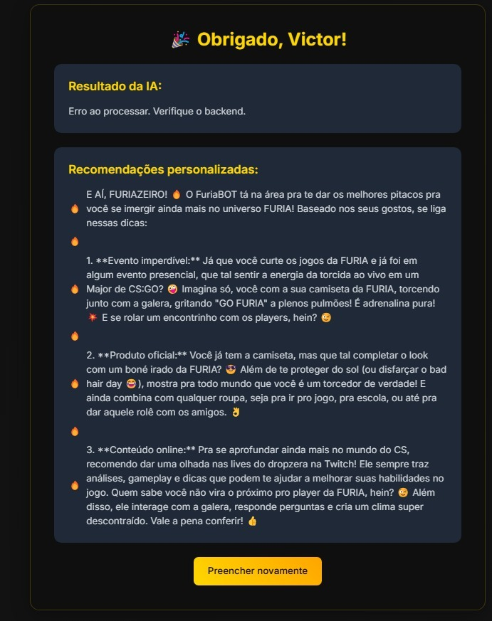

# 🧠 Know Your Fan – FURIA Edition  

Projeto desenvolvido como parte do Desafio Técnico da FURIA Tech.

A proposta é simples e poderosa: analisar perfis sociais por IA, extrair dados automaticamente via OCR, e gerar recomendações personalizadas para fãs da equipe FURIA, com base nas informações fornecidas.

---

## 📸 Imagens da Interface

**Tela de cadastro dos dados do fã**  


**Tela de resposta final com recomendações personalizadas**  


---

## 🔗 Acesse a Demonstração no Vídeo

👉 [](https://www.youtube.com/watch?v=MIO_U4eMipU)

---

## 📹 Vídeo Demonstrativo

> *https://www.youtube.com/watch?v=MIO_U4eMipU&ab_channel=Victorrusso*  
O vídeo mostra o funcionamento completo da aplicação, do upload à resposta gerada.

---

## 🛠️ Tecnologias Utilizadas

| Camada        | Stack                                           |
|---------------|-------------------------------------------------|
| **Frontend**  | HTML + Tailwind CSS + JavaScript Vanilla        |
| **Backend 1** | Node.js (para upload dos arquivos)              |
| **Backend 2** | FastAPI (OCR com Tesseract + IA Gemini)         |
| **OCR**       | Tesseract OCR via Pytesseract                   |
| **Banco**     | SQLite com SQLModel                             |
| **Hospedagem**| Vercel (Frontend) + Render (Backend)            |

---

## ⚙️ Funcionalidades

- **📄 Upload de documentos com OCR:** Extração automática de texto de imagens.
- **🧠 Validação de Perfil por IA:** A IA analisa o comportamento e preferências do fã com linguagem humana.
- **🎯 Recomendação personalizada:** Sugestões personalizadas de eventos, produtos e conteúdo da FURIA.

---

## ⚠️ Observações Importantes

Este projeto foi desenvolvido utilizando ferramentas **gratuitas**, e por isso:

- 🔄 **As respostas podem demorar alguns segundos** (por conta do plano gratuito da Render).
- ⚠️ **O backend pode dormir** após inatividade — aguarde até que o serviço seja reativado.
- ♻️ **A IA utiliza créditos gratuitos do Google Gemini.** Quando os créditos acabarem, o endpoint de validação pode retornar erro.
- ✅ **A lógica está 100% funcional.** Você pode testar a aplicação localmente se quiser ter uma resposta mais rápida e estável.

---

## 🧪 Como Testar Localmente

### 🔧 Requisitos

- Python 3.10+
- Node.js (caso queira simular também o backend de upload)
- Tesseract OCR instalado (em sistemas Linux, use `sudo apt install tesseract-ocr`)

### 🐍 Backend FastAPI (OCR + IA)

```bash
cd backend
python -m venv venv
source venv/bin/activate  # Windows: venv\Scripts\activate
pip install -r requirements.txt
uvicorn main:app --reload
````

### 🌐 Frontend

Abra o arquivo `index.html` dentro da pasta `frontend/` diretamente no navegador, ou use um servidor local.

---

## 🗂️ Estrutura do Projeto

```
know-your-fan/
│
├── backend/
│   ├── main.py
│   ├── validador_social.py
│   ├── models.py
│   ├── requirements.txt
│   ├── Procfile
│   └── Aptfile
│
├── frontend/
│   ├── index.html
│   ├── demo.jpeg
│   └── demo2.jpeg
│
├── README.md
└── vercel.json
```

---

## 👨‍💻 Desenvolvedor

Victor Luiz Russo
🔗 [LinkedIn](https://www.linkedin.com/in/victorrusso7/)

---

## 📌 Conclusão

Esse projeto demonstra a aplicação real de tecnologias como IA, OCR e recomendação personalizada, tudo em um ambiente web moderno e funcional. Ideal para empresas e comunidades que desejam conhecer melhor seus fãs, seguidores ou usuários.
